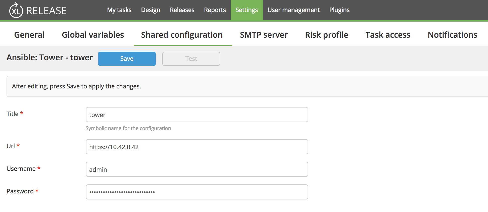
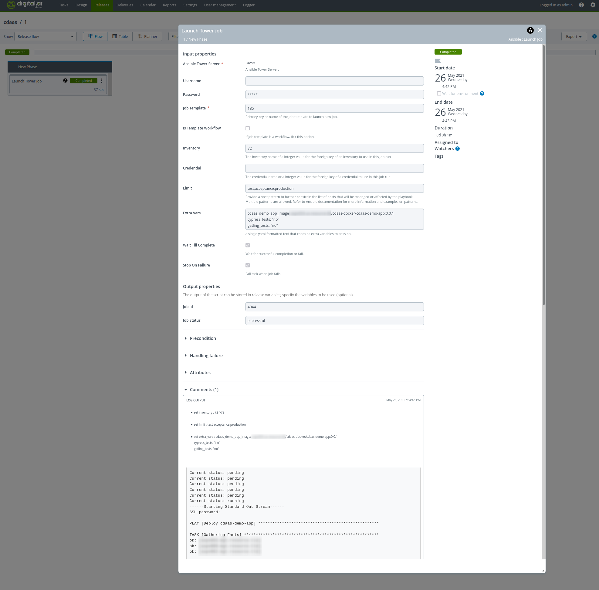
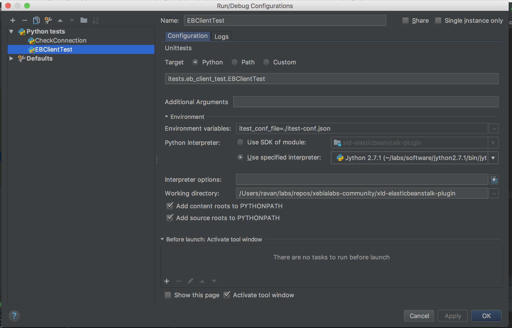

# XL Release Ansible Tower Plugin

[](https://opensource.org/licenses/MIT)
[](https://travis-ci.org/xebialabs-community/xlr-ansible-tower-plugin)
[](https://www.codacy.com/app/ravan/xlr-ansible-tower-plugin?utm_source=github.com&amp;utm_medium=referral&amp;utm_content=xebialabs-community/xlr-ansible-tower-plugin&amp;utm_campaign=Badge_Grade)

## Preface

This document describes the functionality provided by the XL Release Ansible Tower plugin.

 
See the [XL Release reference manual](https://docs.xebialabs.com/xl-release) for background information on XL Release and release automation concepts.  

## Overview
This plugin enables Ansible Tower job execution from XL Release.

## Requirements ##

* XL Release Server 7+
* Python requests library as supplied with xlr-xld-plugin

## Installation

The plugin JAR file can be downloaded from [releases](https://github.com/xebialabs-community/xld-ansible-tower-plugin/releases).
Copy the downloaded JAR into the `SERVER_HOME/plugins` directory of XL Release.

## Usage

### Ansible Tower Server 

Define the url, username and password for the Ansible Tower Server in the XL Release shared configuration section.


### Launch Job Task



## Development ##

### Install Ansible Tower ###

Follow the instructions for the [Ansible Tower Vagrant Installation](https://www.ansible.com/products/tower/trial)

```
$ vagrant init ansible/tower
$ vagrant up --provider virtualbox
$ vagrant ssh
```
That last command will give you your admin password and the Tower log-in URL. Upon login, you will be provided with directions on how to obtain a trial license.

If you are unable to see the url and password after the `vagrant ssh`, try resetting the admin password with `sudo tower-manage changepassword admin`

The Tower server is accessible [https://10.42.0.42](https://10.42.0.42)

### Setting up Ansible Tower credentials ###

Create an `itest-conf.json` file in this projects root folder defining the following content with that for your AWS account.

```
[ {
    "name": "tower",
    "username": "admin",
    "password": "xxxxx",
    "url": "https://10.42.0.42"
  }
]

```

The plugin's Jython Tests will use this file to connect to the Ansible Tower account and run the integration tests.

### Setting up a local Jython interpreter and dependent librariers to run tests ###

Install Jython on your local system by using the [Jython 2.7.1 Installer](http://central.maven.org/maven2/org/python/jython-installer/2.7.1/jython-installer-2.7.1.jar)

Use ___pip___ located in the Jython installation's `bin` directory to install the cli.

`pip install ansible-tower-cli`
`pip uninstall requests`
`pip install requests=2.11.1`


### Setting up Gradle for Jython tests ###

Create an `gradle.properties` in this project's root folder defining the following content making adjustments for your Jython installation.

```
jythonInterpreter=/Users/ravan/labs/software/jython-2.7.1/bin/jython
```

Your Jython tests should be written with the [Python 2 Unit testing framework](https://docs.python.org/2/library/unittest.html) and the file name should match the pattern `*_test.py`

### Running Tests from Gradle ###

From the project root, 

* Run all tests with `./gradlew clean build itest` 

* Run a single test with `./gradlew runTest -DtestName=itests.launch_job_test.LaunchJobTest`

	The `testName` parameter is the absolute reference to the test class.
	
### Running Tests from IDE ###

You can also run and debug tests from Intellij using a __python test__ configuration similar to the one below.


	

---

