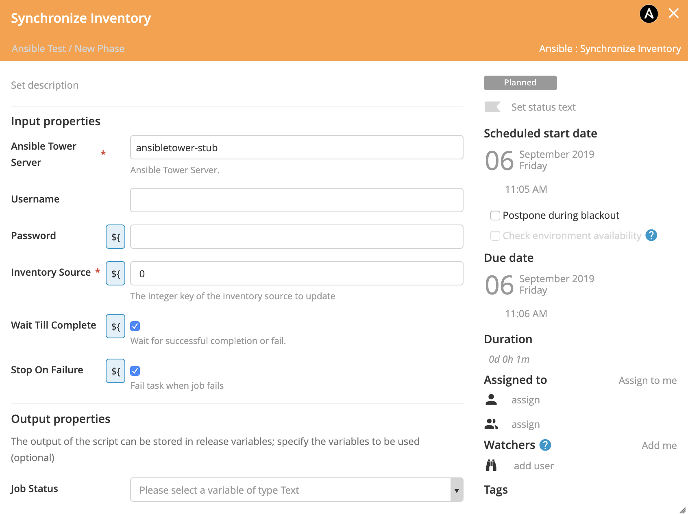

# XL Release Ansible Tower Plugin


[](https://travis-ci.org/xebialabs-community/xlr-ansible-tower-plugin)
[](https://www.codacy.com/manual/ladamato/xlr-ansible-tower-plugin?utm_source=github.com&amp;utm_medium=referral&amp;utm_content=xebialabs-community/xlr-ansible-tower-plugin&amp;utm_campaign=Badge_Grade)
[](https://opensource.org/licenses/MIT)
[![Github All Releases][xlr-ansible-tower-plugin-downloads-image]]()


[xlr-ansible-tower-plugin-downloads-image]: https://img.shields.io/github/downloads/xebialabs-community/xlr-ansible-tower-plugin/total.svg

## Preface

This document describes the functionality provided by the XL Release Ansible Tower plugin.

See the [XL Release reference manual](https://docs.xebialabs.com/xl-release) for background information on XL Release and release automation concepts.  

## Overview

This plugin enables Ansible Tower job execution from XL Release.

## Requirements

* XL Release Server 7+, has been tested with 9.7
* Python requests library as supplied with xlr-xld-plugin

## Installation

The plugin JAR file can be downloaded from [releases](https://github.com/xebialabs-community/xlr-ansible-tower-plugin/releases).
Copy the downloaded JAR into the `SERVER_HOME/plugins/__local__` directory of XL Release.

## Usage

### Ansible Tower Server

Define the url, username and password for the Ansible Tower Server in the XL Release shared configuration section.


### Launch Job Task


### Synchronize Inventory Task



## Develop and Demo

Build and package the plugin with...

```bash
./gradlew build
```

### To run integration tests -

1. You will need to have Docker and Docker Compose installed
2. The XL-Release image expects to find a valid XL-Release license on your machine, at this location: ~xl-licenses/xl-release-license.lic
3. Open a terminal in the root of the xlr-ansible-tower-plugin project and run the test -

```bash
./gradlew clean integrationTest
```

The test will set up a temporary xlr/mockserver testbed using docker. NOTE: The integration tests take about 3 minutes to run.

1. The mock server acts as an Ansible Tower server. The mockserver responds to requests with json responses similar to those served by an Ansible Tower server.
2. After testing is complete, the test docker containers are stopped and removed.

### To run demo or dev version (set up the docker containers and leave them running) -

1. For requirements, see the 'To run integration tests' above
2. Build the xlr-ansible-tower-plugin.jar - Open a terminal and cd into <xlr-selenim-plugin code base> and run ./gradlew clean build . **Be sure to re-run the command whenever code is changed.**
3. From another terminal, cd into the <xlr-ansible-tower-plugin code base>/src/test/resources/docker/  directory.
4. Run (necessary the first time only): docker-compose build
5. Then run: docker-compose up -d
6. XL Release will run on the [localhost port 15516](http://localhost:15516/). It may take up to a minute for XL Release to start up
7. The XL Release username / password is admin / admin
8. After XL Release has started, you can set up a template and shared configuration server by running the script <xlr-ansible-tower-plugin code base>/src/test/resources/docker/initialize/initialize_data.sh. Alternatively, follow the steps below:
    1. within XL Release->Settings->Shared Configurations, configure an Ansible Tower Server with the following attributes:
        1. Title -> ansibletower-stub
        2. Url -> <http://ansibletower-stub:5000>
        3. Username -> admin
        4. Password -> admin
    2. Within XL Release, navigate to the Templates page and use the import feature to import the template located here: <xlr-ansible-tower-plugin code base>/src/test/resources/docker/initialize/data/release-template.json .
9. You can now run a release based the template named 'Ansible Test'.
10. When code is modified, re-run the ./gradlew clean build (in the first terminal), then refresh the testbed by running docker-compose down followed by docker-compose up -d (in the second terminal) and after XL Release starts up, re-import the server configuration and the template or configure manually.

Further Demo/Dev Notes:

1. The log files will be persisted to the local directory <xlr-ansible-tower-plugin code base>/build/reports/tests/log directory.
2. The Mockserver runs on the [localhost port 5099](http://localhost:5099/)
3. The mockserver response files used in the demo are located in the <xlr-ansible-tower-plugin code base>/src/test/resources/ansible-stub/responses directory
4. If you add response files, be sure to rebuild the mockserver docker image

## References

<https://docs.ansible.com/ansible-tower/latest/html/towerapi/api_ref.html>

---
